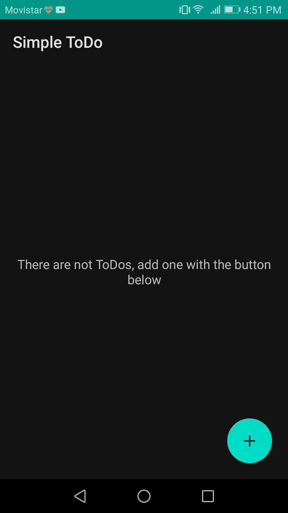
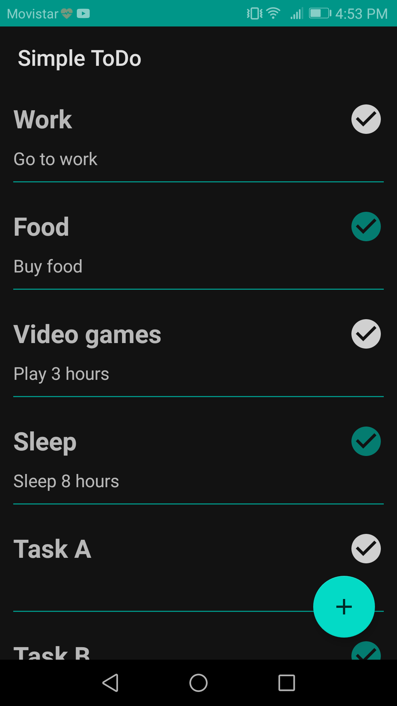
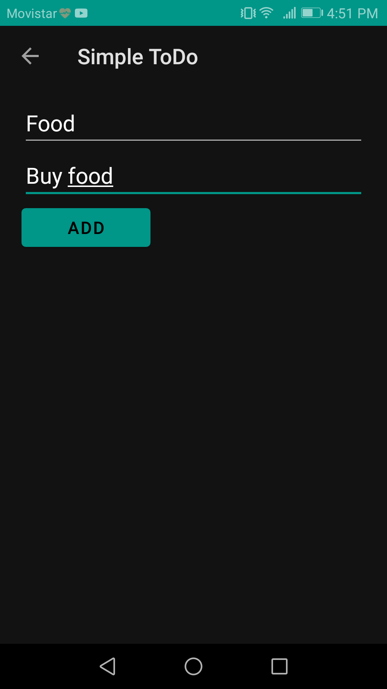
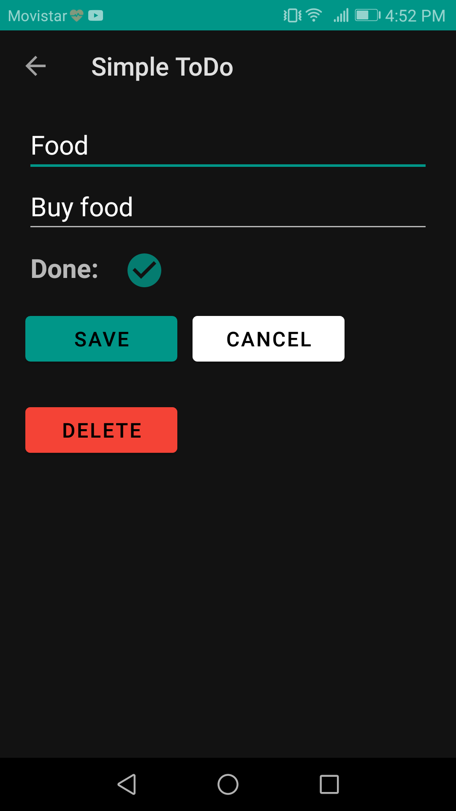

# Simple-ToDo
A simple ToDo app in native Android with a little navigation and a local database / Una simple app de ToDo en Android nativo con navegación y una base de datos local.

## See the app in action / Mire la aplicación en funcionamiento

## Some features / Algunas características

- Local database CRUD with SQLite
- ViewModel and LiveData
- Navigation and changes of state from multiples activities
- RecyclerView and auto refresh of the list when the state is changed by any activity
- Load assets files

## Some images / Algunas imágenes

 

 